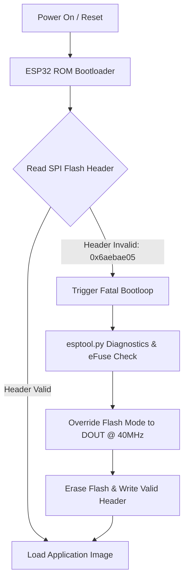

# ⚡ ESP32 Bare-Metal Hardware & Bootloader Diagnostic

A diagnostic harness and low-level root-cause analysis (RCA) suite designed to isolate ESP32 bootloops, SPI flash communication timing errors, and hardware memory degradation.

---

## 📌 Project Overview

This repository documents the diagnostic methodology, register analysis, and flashing overrides required to isolate low-level ESP32 boot failures. It includes a minimal hardware verification sketch, serial telemetry capture, and a detailed post-mortem report.

### System Architecture & Diagnostic Flow

📁 Repository Structure
    esp32_hardware_test/
├── assets/                  # Diagrams, telemetry output, and screenshots
├── src/
│   └── main.cpp             # Minimal bare-metal UART telemetry sketch
├── platformio.ini           # PlatformIO configuration (DOUT bus topology @ 40MHz)
├── POST_MORTEM.md           # Root-cause analysis & hardware flash degradation report
└── README.md                # Project documentation

📖 Key Documentation
🔍 Read the Full Technical Post-Mortem (POST_MORTEM.md) — Comprehensive breakdown of the invalid header: 0x6aebae05 failure, isolating BoyaMicro (0x68) SPI flash IC signal timing degradation via esptool.py and low-level eFuse flags.

🛠 Tech Stack & Diagnostic Tools
Target Hardware: ESP32-D0WD-V3 (Revision 3.1) with BoyaMicro BY25Q32BS 4MB Flash

Core Toolchain: PlatformIO CLI, esptool.py, espefuse.py, PowerShell

Protocols & Interfaces: SPI (QIO / DIO / DOUT modes), UART Serial Telemetry, eFuse LDO Configuration

🚀 Quick Start & Reproduction
Prerequisites
PlatformIO CLI installed.

USB-to-UART drivers (CP210x or CH340) configured for your ESP32 board.

Flashing & Monitoring Sequence

Clone the repository:
git clone [https://github.com/ShadowBit24/esp32_hardware_test.git](https://github.com/ShadowBit24/esp32_hardware_test.git)
cd esp32_hardware_test

Wipe corrupted flash headers via esptool:
platformio pkg exec -p tool-esptoolpy -- esptool.py --port COMx erase_flash --force

(Replace COMx with your active serial port, e.g., COM3 or /dev/ttyUSB0)

Build and upload firmware with forced DOUT bus configuration:
platformio run --target upload

Monitor live serial telemetry output (115200 Baud):
platformio device monitor --baud 115200

📄 License
This project is open-source and available under the MIT License.